# vite-devtools-plugin-svelte

Svelte DevTools plugin for [Vite DevTools](https://github.com/nicepkg/vite-devtools). Provides 15 specialized panels for debugging, profiling, and inspecting Svelte/SvelteKit applications — all integrated directly into the Vite DevTools UI.

> **Status:** Early development (v0.0.1). APIs may change.

## Features

- **Component Inspector** — View component hierarchy, props, state, and reactive values in real-time
- **Reactive Graph** — Visualize `$state`, `$derived`, and `$effect` dependencies as an interactive DAG
- **Render Profiler** — Track component render counts, render times, and identify bottlenecks
- **Route Viewer** — Explore SvelteKit file-based routing structure with dynamic parameters
- **Load Profiler** — Monitor SvelteKit `load` functions with waterfall visualization
- **State Timeline** — Record and replay state changes across the application
- **API Playground** — Test SvelteKit server endpoints (`+server.ts`) directly from DevTools
- **Error Dashboard** — Centralized view of compiler warnings and runtime errors
- **Code Inspector** — View compiled Svelte output with source mapping
- **Module Graph** — Visualize module dependencies and detect circular imports
- **OG Preview** — Preview Open Graph meta tags for SEO validation
- **Build Analysis** — Analyze build chunks and bundle composition
- **FPS Monitor** — Real-time frame rate monitoring with historical data
- **Asset Browser** — Browse and preview static assets with metadata
- **Overview** — Project summary with versions and dependency info

### Screenshots

<details>
<summary>Overview</summary>

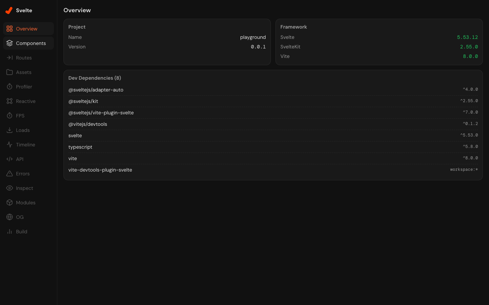

</details>

<details>
<summary>Components</summary>

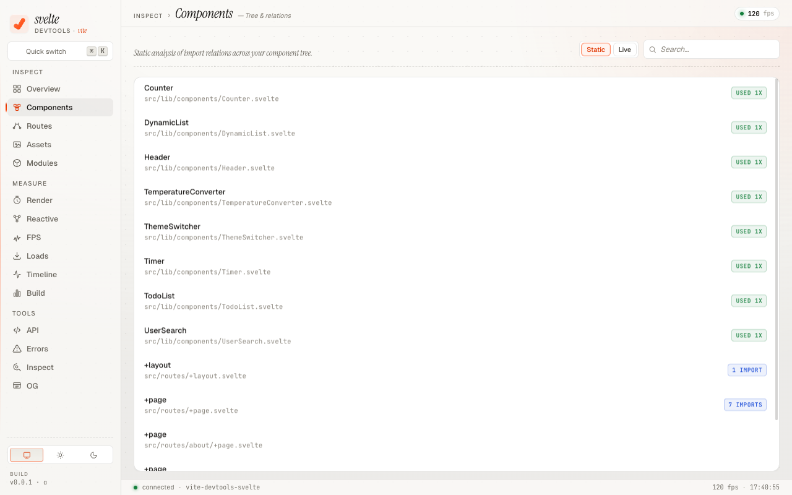

</details>

<details>
<summary>Routes</summary>

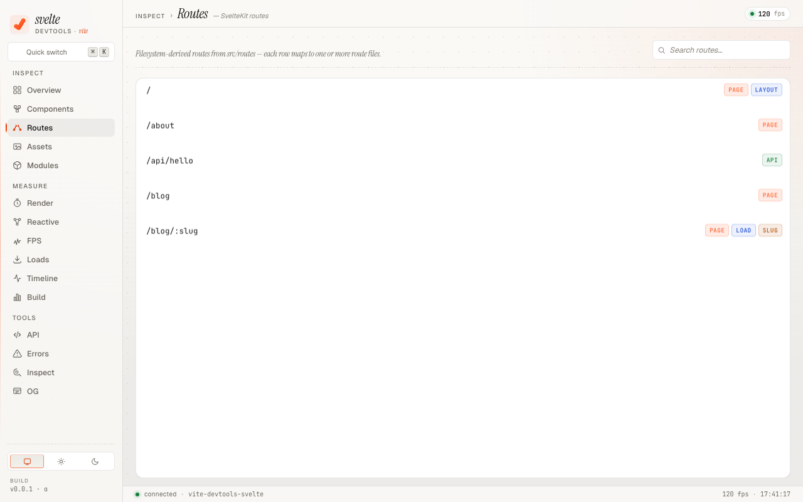

</details>

<details>
<summary>Assets</summary>

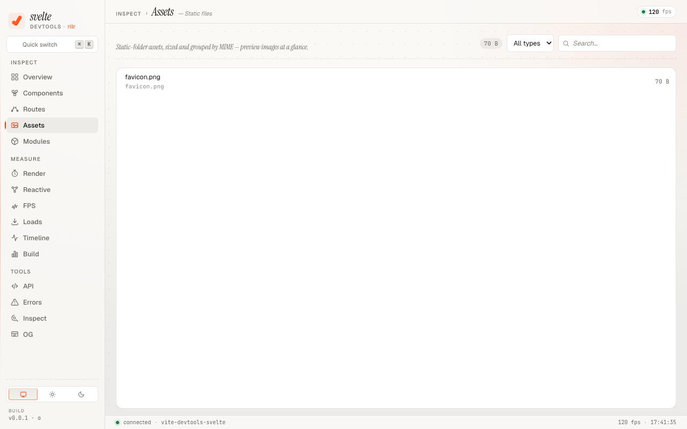

</details>

<details>
<summary>Render Profiler</summary>

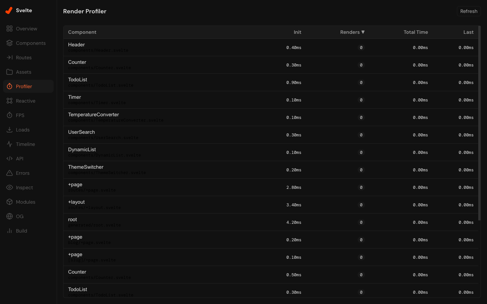

</details>

<details>
<summary>Reactive Graph</summary>

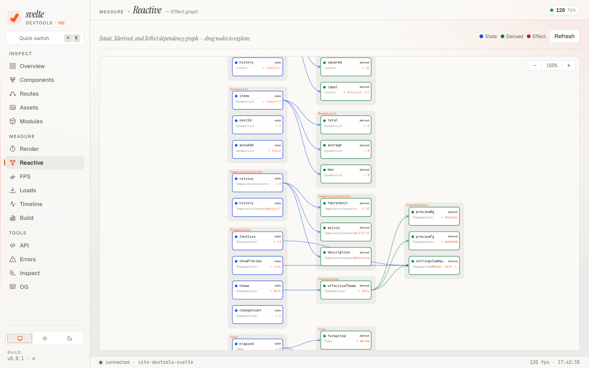

</details>

<details>
<summary>FPS Monitor</summary>

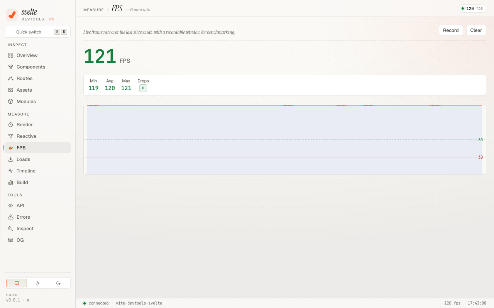

</details>

<details>
<summary>Load Profiler</summary>

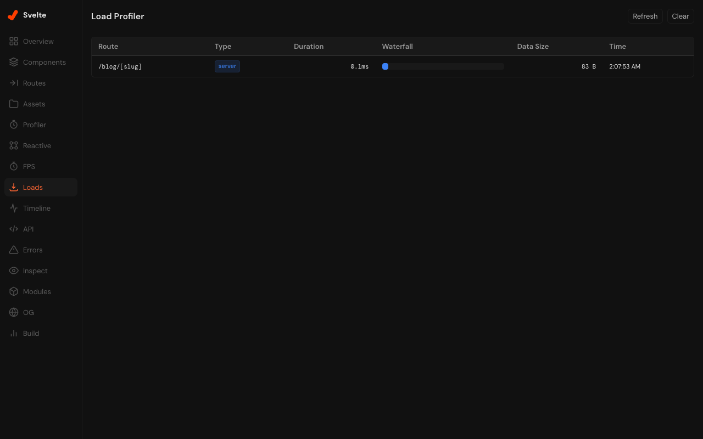

</details>

<details>
<summary>State Timeline</summary>

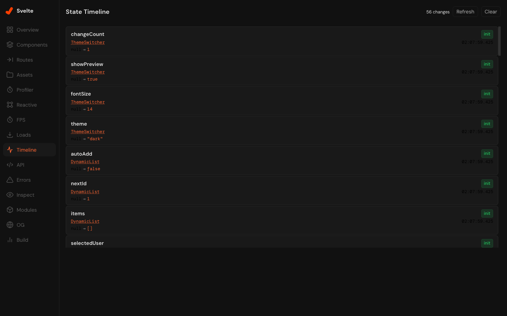

</details>

<details>
<summary>API Playground</summary>

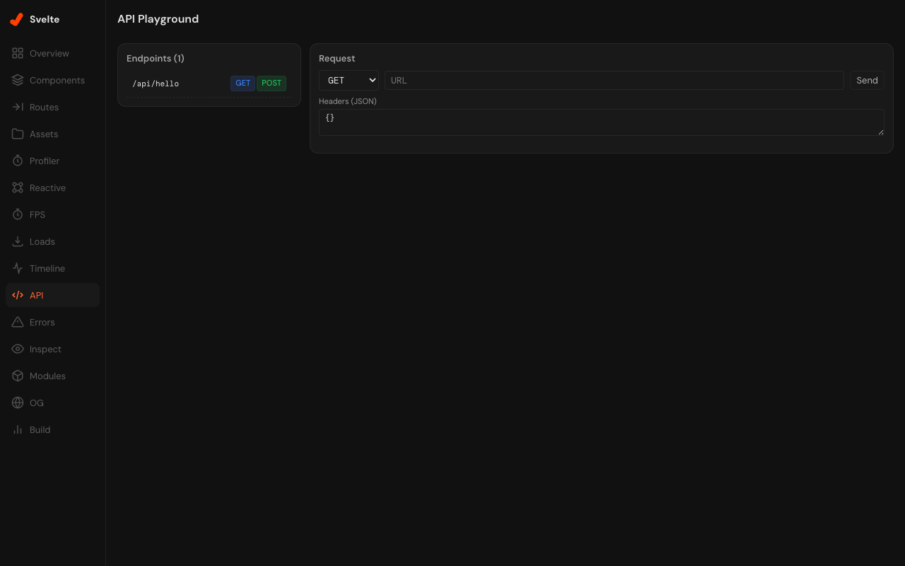

</details>

<details>
<summary>Errors & Warnings</summary>

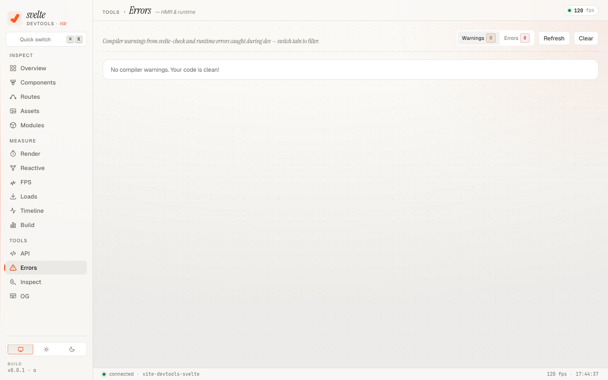

</details>

<details>
<summary>Code Inspector</summary>

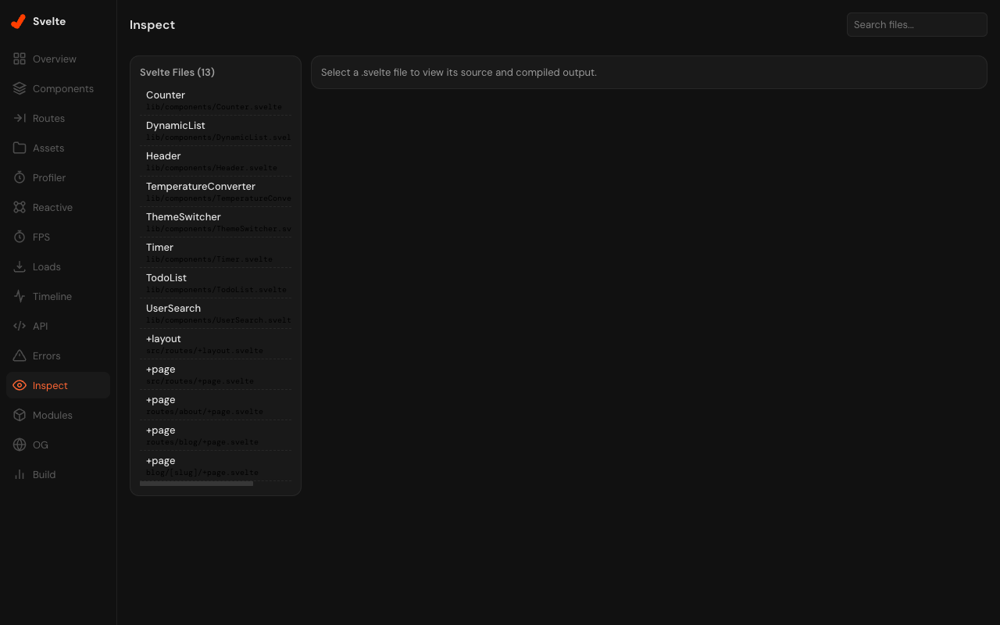
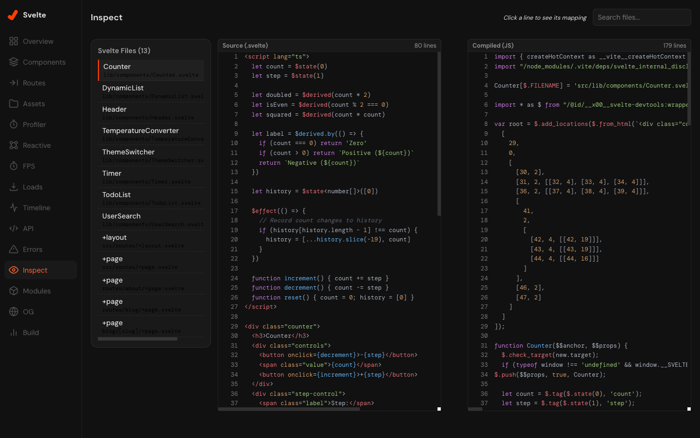

</details>

<details>
<summary>Module Graph</summary>

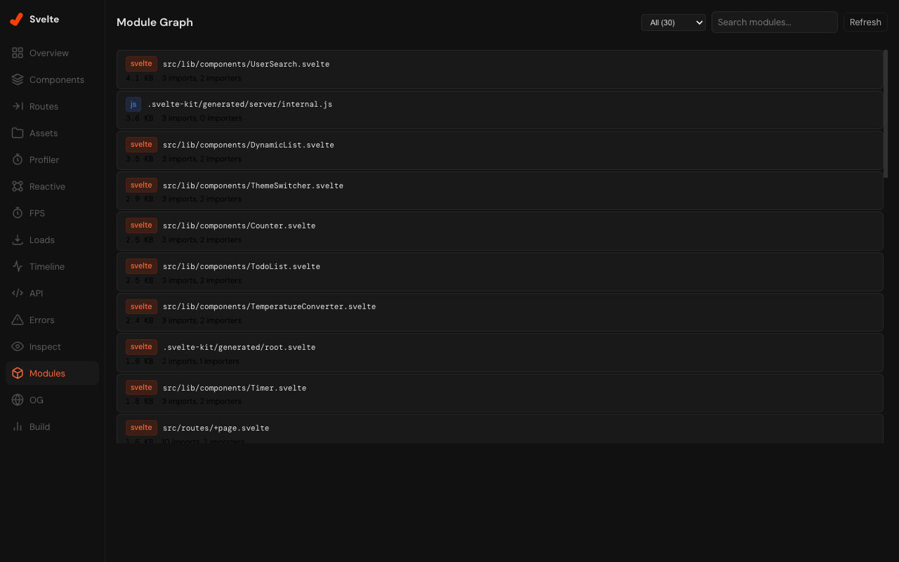

</details>

<details>
<summary>OG Preview</summary>

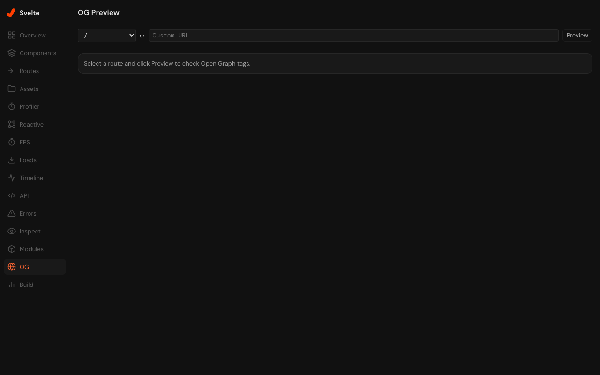

</details>

<details>
<summary>Build Analysis</summary>

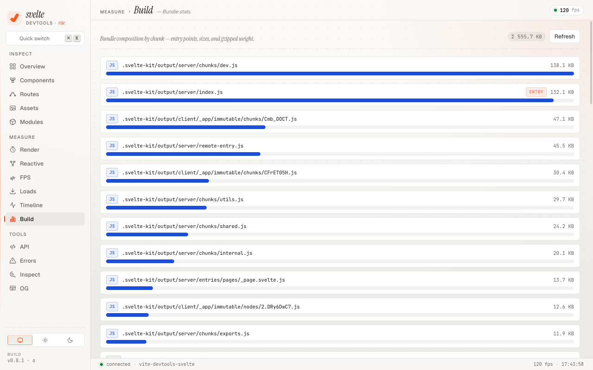

</details>

## Requirements

- **Vite** >= 8.0.0
- **Svelte** 5 (runes mode)
- **SvelteKit** (recommended, but not required for basic features)

## Installation

```bash
npm install -D vite-devtools-plugin-svelte
```

## Setup

Add the plugin to your `vite.config.ts`. **It must come before `sveltekit()`** so that the transforms run before the Svelte compiler.

```ts
// vite.config.ts
import { svelteDevtools } from 'vite-devtools-plugin-svelte'
import { sveltekit } from '@sveltejs/kit/vite'
import { defineConfig } from 'vite-plus'

export default defineConfig({
  plugins: [
    svelteDevtools(),
    sveltekit(),
  ],
})
```

> **Note:** This project uses [Vite+](https://viteplus.dev/) as its toolchain. If you use plain Vite, replace `'vite-plus'` with `'vite'` in the import above.

Then start your dev server as usual:

```bash
vp dev
# or with plain Vite: npm run dev
```

The Svelte DevTools panels will appear inside the Vite DevTools UI.

## Options

```ts
svelteDevtools({
  // Enable component lifecycle tracking (default: true)
  componentTracking: true,
})
```

## How It Works

The plugin uses a **virtual module architecture** instead of fragile regex transforms:

1. **Runtime wrapper** — Intercepts `svelte/internal/client` to track component lifecycle and reactive signals (`$state`, `$derived`, `$effect`)
2. **HMR channel** — Streams runtime data (component tree, render profiles, reactive graph) from the browser to the dev server via WebSocket
3. **Static analyzers** — Extract routes, component relations, assets, and project metadata from the filesystem
4. **Dual transport RPC** — DevTools Kit RPC with HTTP fallback for compatibility

The plugin is **development-only** — it adds zero overhead to production builds.

## Security model

The DevTools backend exposes a small set of dev-only HTTP endpoints (`/__svelte-devtools/rpc`, `/__svelte-devtools/asset`) to drive the panel UI. Some of those endpoints can read files from disk or open them in your editor, so we treat them as authenticated even though the dev server is normally only reachable from `localhost`.

- **Per-process random token.** On every dev-server start the plugin generates a fresh UUID and injects it into the DevTools UI HTML as a `<meta>` tag. The HTTP fallback RPC and the asset middleware require that token in the `x-svelte-devtools-token` header, plus a same-origin `Origin`/`Referer`. Cross-origin requests, requests with the wrong token, and requests without `Content-Type: application/json` are rejected with `403` / `415`. Bodies above 1 MB are rejected with `413`.
- **Path sandbox.** `inspect-file`, `open-in-editor`, and `open-reactive-in-editor` resolve their input through `fs.realpath()` and refuse anything outside the project root, so a hostile RPC caller cannot read `/etc/passwd` or your `~/.ssh/` files even if they get past the token check. Symlinks inside the project are followed normally.
- **SSRF defenses.** Outbound fetches from `send-api-request` and the OG-preview RPC block `127.0.0.0/8` / `10.0.0.0/8` / `172.16.0.0/12` / `192.168.0.0/16` / `169.254.0.0/16` / IPv6 loopback / `localhost` / `*.local` / `*.internal`.
- **Dev-only by construction.** Both the runtime virtual module and the `svelte/internal/client` wrapper are gated on `config.command === 'serve'` and never resolve during a production build, so none of this surface ships to end users.

If you bind your dev server to `0.0.0.0` (e.g. `vite --host`), the same-origin check still blocks LAN browsers from invoking RPC, but anyone on the LAN can still see the panel UI itself. Treat that as you would any unauthenticated dev tool: don't run it on networks you don't trust.

## Development

This is a pnpm monorepo.

```bash
# Install dependencies
pnpm install

# Build everything
pnpm build

# Run the playground app with DevTools
pnpm dev

# Run tests
pnpm -C packages/vite-devtools-plugin-svelte test

# Watch mode
pnpm -C packages/vite-devtools-plugin-svelte test:watch
```

### Project Structure

```
├── packages/vite-devtools-plugin-svelte/
│   ├── src/              # Plugin core (Vite plugin, runtime, analyzers)
│   ├── client/           # DevTools UI (Svelte 5 SPA)
│   └── dist/             # Build output
├── playground/           # Demo SvelteKit app for development
└── docs/images/          # Screenshots
```

## Contributing

Contributions are welcome! Please open an issue first to discuss what you'd like to change.

## License

[MIT](LICENSE)
