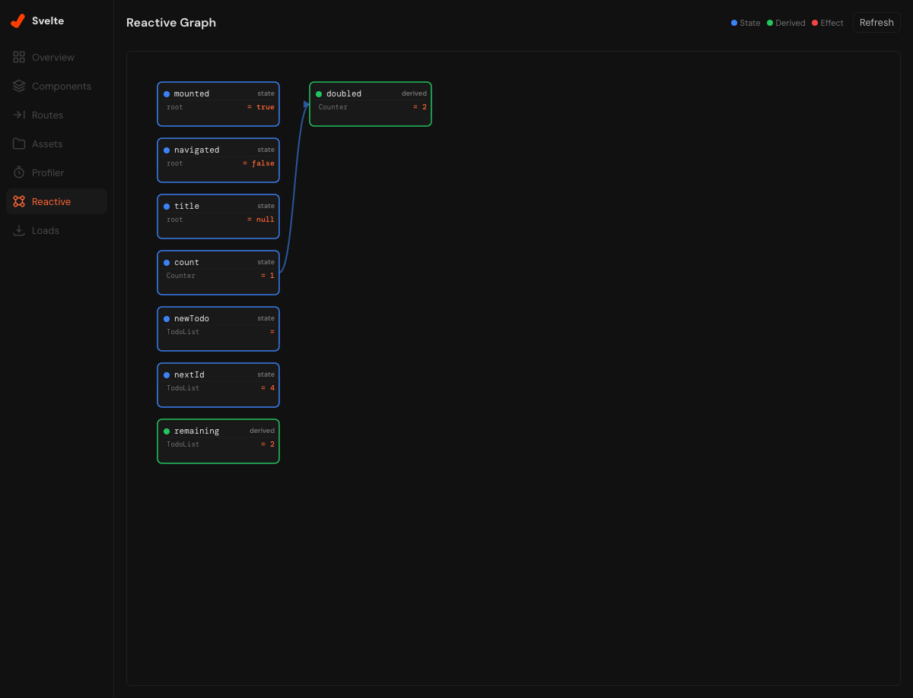
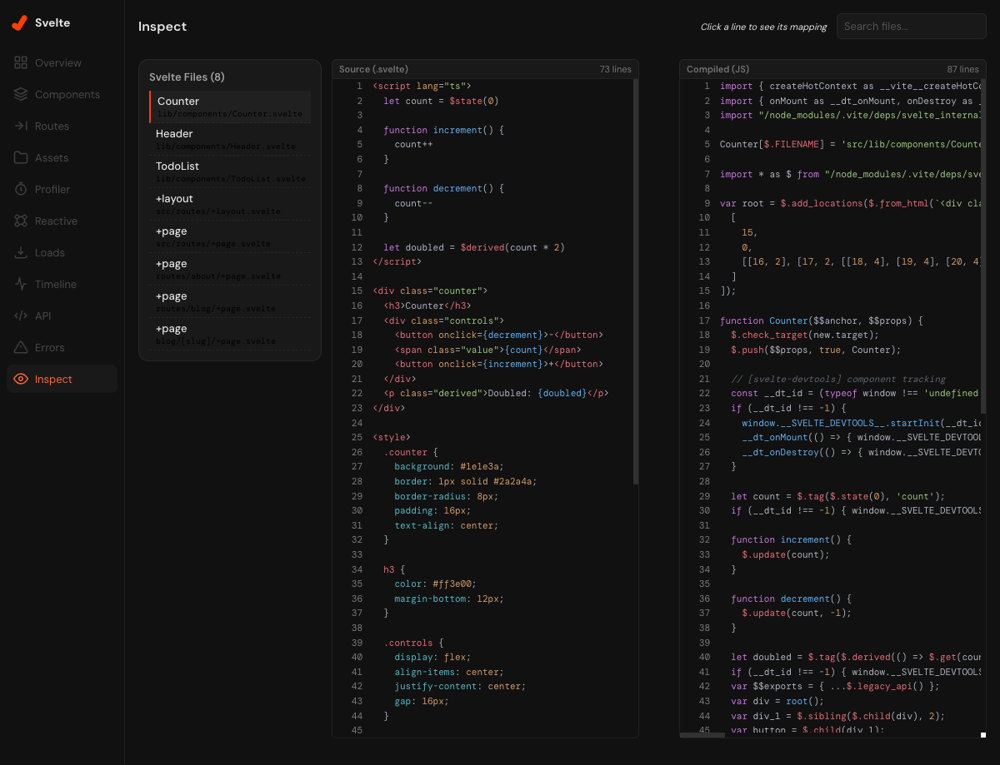
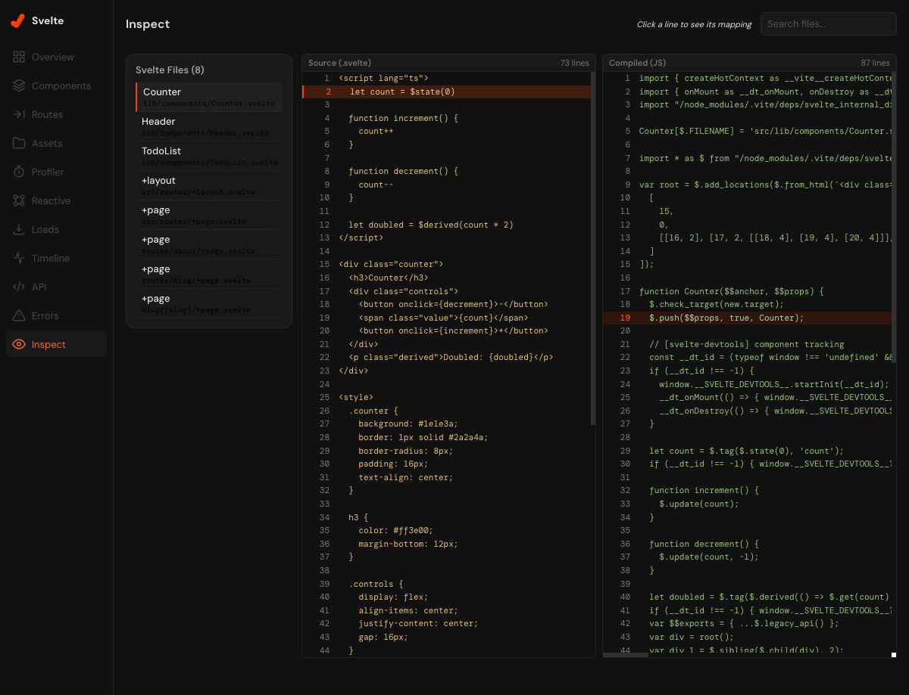

# vite-devtools-plugin-svelte

Svelte DevTools plugin for [Vite DevTools](https://github.com/nicepkg/vite-devtools). Provides 15 specialized panels for debugging, profiling, and inspecting Svelte/SvelteKit applications — all integrated directly into the Vite DevTools UI.

> **Status:** Early development (v0.0.1). APIs may change.

## Features

- **Component Inspector** — View component hierarchy, props, state, and reactive values in real-time
- **Reactive Graph** — Visualize `$state`, `$derived`, and `$effect` dependencies as an interactive DAG
- **Render Profiler** — Track component render counts, render times, and identify bottlenecks
- **Route Viewer** — Explore SvelteKit file-based routing structure with dynamic parameters
- **Load Profiler** — Monitor SvelteKit `load` functions with waterfall visualization
- **State Timeline** — Record and replay state changes across the application
- **API Playground** — Test SvelteKit server endpoints (`+server.ts`) directly from DevTools
- **Error Dashboard** — Centralized view of compiler warnings and runtime errors
- **Code Inspector** — View compiled Svelte output with source mapping
- **Module Graph** — Visualize module dependencies and detect circular imports
- **OG Preview** — Preview Open Graph meta tags for SEO validation
- **Build Analysis** — Analyze build chunks and bundle composition
- **FPS Monitor** — Real-time frame rate monitoring with historical data
- **Asset Browser** — Browse and preview static assets with metadata
- **Overview** — Project summary with versions and dependency info

### Screenshots

<details>
<summary>Reactive Graph</summary>



</details>

<details>
<summary>Code Inspector</summary>




</details>

## Requirements

- **Vite** >= 8.0.0
- **Svelte** 5 (runes mode)
- **SvelteKit** (recommended, but not required for basic features)

## Installation

```bash
npm install -D vite-devtools-plugin-svelte
```

## Setup

Add the plugin to your `vite.config.ts`. **It must come before `sveltekit()`** so that the transforms run before the Svelte compiler.

```ts
// vite.config.ts
import { svelteDevtools } from 'vite-devtools-plugin-svelte'
import { sveltekit } from '@sveltejs/kit/vite'
import { defineConfig } from 'vite'

export default defineConfig({
  plugins: [
    svelteDevtools(),
    sveltekit(),
  ],
})
```

Then start your dev server as usual:

```bash
npm run dev
```

The Svelte DevTools panels will appear inside the Vite DevTools UI.

## Options

```ts
svelteDevtools({
  // Enable component lifecycle tracking (default: true)
  componentTracking: true,
})
```

## How It Works

The plugin uses a **virtual module architecture** instead of fragile regex transforms:

1. **Runtime wrapper** — Intercepts `svelte/internal/client` to track component lifecycle and reactive signals (`$state`, `$derived`, `$effect`)
2. **HMR channel** — Streams runtime data (component tree, render profiles, reactive graph) from the browser to the dev server via WebSocket
3. **Static analyzers** — Extract routes, component relations, assets, and project metadata from the filesystem
4. **Dual transport RPC** — DevTools Kit RPC with HTTP fallback for compatibility

The plugin is **development-only** — it adds zero overhead to production builds.

## Development

This is a pnpm monorepo.

```bash
# Install dependencies
pnpm install

# Build everything
pnpm build

# Run the playground app with DevTools
pnpm dev

# Run tests
pnpm -C packages/vite-devtools-plugin-svelte test

# Watch mode
pnpm -C packages/vite-devtools-plugin-svelte test:watch
```

### Project Structure

```
├── packages/vite-devtools-plugin-svelte/
│   ├── src/              # Plugin core (Vite plugin, runtime, analyzers)
│   ├── client/           # DevTools UI (Svelte 5 SPA)
│   └── dist/             # Build output
├── playground/           # Demo SvelteKit app for development
└── docs/images/          # Screenshots
```

## Contributing

Contributions are welcome! Please open an issue first to discuss what you'd like to change.

## License

[MIT](LICENSE)
