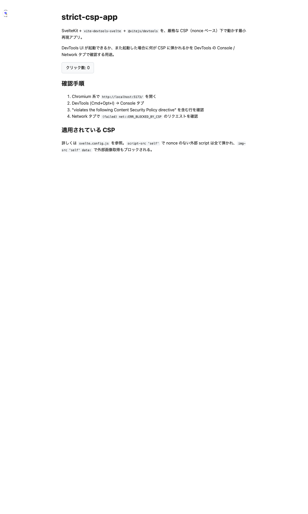

# strict-csp-app — CSP / SSR 検証用最小再現アプリ

[Issue #51](https://github.com/baseballyama/vite-devtools-svelte/issues/51) の関連挙動を再現・計測するための最小 SvelteKit アプリ。

このアプリは **意図的に 2 つの罠を踏むように** 作られている:

1. SvelteKit の strict CSP（nonce ベース）
2. SvelteKit dev での `transformIndexHtml` バイパス問題

## 起動

```bash
pnpm install
pnpm -w build              # vite-devtools-svelte plugin + client
pnpm -C examples/strict-csp-app dev
```

`http://localhost:5173/` を開くと、左上に Vite DevTools のアイコン（折りたたまれたドック）が出る。
クリックでドックを開ける。



## 検証結果（2026-05-30 時点 / `@vitejs/devtools@0.2.0`）

### ✅ #51-1: README に `DevTools()` 登録が抜けている

[PR #55](https://github.com/baseballyama/vite-devtools-svelte/pull/55) で対応済み。

### ⚠️ #51-2: SvelteKit では `import '@vitejs/devtools/client/inject'` が **本当に必要**

- `@vitejs/devtools` の `DevTools()` プラグインは内部の `DevToolsInjection` で `transformIndexHtml` を使い `<script src=".../client/inject.js">` を `<body>` に注入する。
- **しかし SvelteKit dev は app.html を独自の SSR パイプラインで処理するため、Vite の `transformIndexHtml` フックを通さない。**
- 結果: SvelteKit のページには inject script が一切入らず、ドックが出ない。
  - 本リポジトリの `playground` / `examples/sample-app` の HTML を curl で確認しても、inject script は HTML に存在しない。`playground` は `Header.svelte` 内に `/__devtools/` への外部リンクを足してこれを回避している。
- ワークアラウンドとして `+layout.svelte` で `import('@vitejs/devtools/client/inject')` すると、Vite のモジュールパイプラインで配信されるため SvelteKit の nonce 付き chunk として読み込まれ、ドックが復活する。
- **さらなる罠**: `client/inject.js` は top-level で `window` を触るため、`if (browser)` で囲まないと SSR 中に `ReferenceError: window is not defined` で dev サーバーが落ちる（本アプリの `+layout.svelte` を参照）。

**→ これは `@vitejs/devtools` 側の問題（SvelteKit 統合不備 + SSR 非対応）。** upstream に報告すべき。

### ✅ #51-3: `connect-src` の WS ポート

- 報告者は `ws://localhost:7812` への接続が CSP に弾かれたと書いていたが、**本検証では 7812 への接続は発生しなかった**。Vite の HMR WS（dev サーバーと同 origin、同ポート）に相乗りしている。
- 当アプリの CSP には `connect-src 'self' ws://localhost:* http://localhost:*` を入れてあり、ドックは正常に通信できている（ネットワークログで `/__devtools/__connection.json` が 200 を返すのを確認）。
- 7812 は古い `@vitejs/devtools` バージョン（reporter は 0.1.24）の挙動の可能性が高い。**→ 現バージョンでは問題なし**。

### ⏳ #51-4: `api.iconify.design` / `unocss.dev/logo.svg` の CSP 違反

- 初期ロード時には観測されず。ドックを開いて特定のパネルに切り替えたときに発生する可能性が高い（reporter のスタックトレースが `DockStandalone-...` 由来であることから、スタンドアロン UI を開いたときの遅延読み込み）。
- 再現するなら `/__devtools/` を直接開いて、各 dock entry に切り替えると iconify アイコン取得が走る。
- これは `@vitejs/devtools` UI が **実行時に外部から SVG アイコンを取得している** のが原因で、strict CSP 環境では避けようがない設計。**→ upstream 案件**。

### ✅ #51-5: Vue feature flags 警告

- console.warn として確実に再現:
  > `[warning] Feature flags __VUE_OPTIONS_API__, __VUE_PROD_DEVTOOLS__, __VUE_PROD_HYDRATION_MISMATCH_DETAILS__ are not explicitly defined. ... @ http://localhost:5173/@vite/client:524`
- `@vitejs/devtools` の UI が Vue で書かれており、esm-bundler ビルドを使っている。
- **→ `@vitejs/devtools` 側のビルド設定問題**。upstream 案件。

### ⏳ #51-6: `Max payload size exceeded` (WebSocket)

- 短時間の検証では再現せず。Sporadic との報告。
- 大量の HMR メッセージや devtools のリアクティブグラフ送信時に WS フレームの上限を超える可能性。
- **再現したら別途 issue を切る**。

## 観測された CSP-related な console エラー（補足）

`devtoolskit:internal:messages:list from client [0]` が `Unauthorized` で返るのは、CSP とは無関係で `@vitejs/devtools` の RPC 認可周りのバグ（reporter にも出ていたかは不明）。

## まとめ: どこに issue を切るべきか

| #   | 振り分け先                                                                                                                             |
| --- | -------------------------------------------------------------------------------------------------------------------------------------- |
| 1   | 本リポジトリ（PR #55）                                                                                                                 |
| 2   | upstream（`vitejs/devtools`） — SvelteKit dev で `transformIndexHtml` が走らない件 + `client/inject` が top-level で `window` を触る件 |
| 3   | クローズ可（現バージョンで再現せず）                                                                                                   |
| 4   | upstream（`vitejs/devtools`） — UI が外部アイコンを実行時取得する件                                                                    |
| 5   | upstream（`vitejs/devtools`） — Vue feature flags の build config 件                                                                   |
| 6   | 再現待ち                                                                                                                               |
